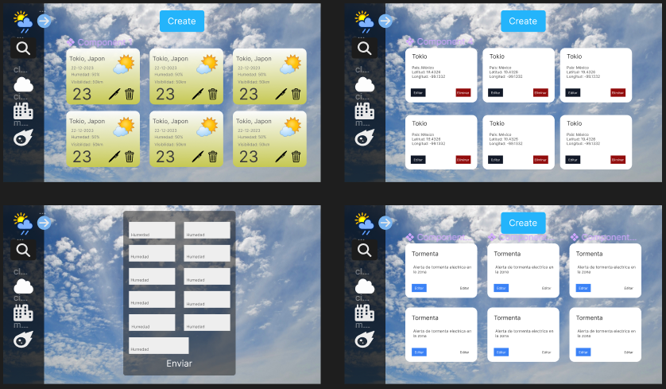
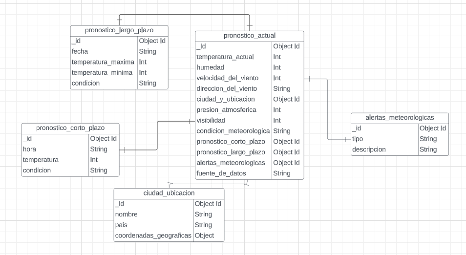

# PRE_FILTRO

## Autor: **Cristian Camilo Luna Morales** 

## Objetivos del Proyecto

Este sistema se diseñó con la finalidad de informar a los usuarios sobre las condiciones climáticas de diversas ciudades y países alrededor del mundo.


#### FIGMA

* https://www.figma.com/file/Lsauuh1IrKmYiG7FQIyhzy/Untitled?type=design&node-id=0-1&mode=design&t=HPOHIwSTj5uKrYQs-0



#### DIAGRAMA DE LA DATABASE

* https://lucid.app/lucidchart/2d31c4c9-f6c2-47d5-ad85-56cfd057cbaf/edit?invitationId=inv_29817c55-3b57-49e4-b40e-3627db346464&page=0_0#



#### SWAGGER


1. Primero se tiene que instalar el node_modules del BackEnd

```bash
cd backend
```
```bash
npm i
```

2. Segundo haga click aqui 👇👇


[Swagger](http://localhost:6996/api-doc/#/)       (Click aqui)


